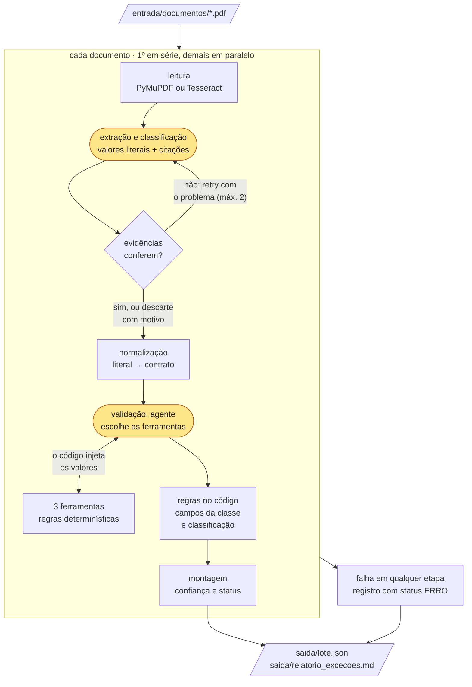

# asset-servicing-case

Agente code-first que lê avisos de eventos corporativos (PDF nativo ou escaneado) e gera, para cada documento, um **JSON auditável**, mais um **relatório de exceções** do lote. Princípio do desenho: **o LLM extrai, o código decide.** O modelo lê, classifica e escolhe as validações; a conferência das evidências, as regras, a confiança e o roteamento são código determinístico e testado.

## Como rodar

Requisitos: Python 3.14 e Tesseract com o idioma português (o OCR do doc 07, escaneado).

| Sistema | Instalação |
|---|---|
| macOS | `brew install python@3.14 tesseract tesseract-lang` |
| Windows | Python 3.14 de [python.org](https://www.python.org/downloads/); Tesseract pelo [instalador da UB Mannheim](https://github.com/UB-Mannheim/tesseract/wiki), marcando *Portuguese* em *Additional language data* |
| Linux (Debian/Ubuntu) | Python 3.14 (python.org ou o gerenciador da distribuição); `sudo apt install tesseract-ocr tesseract-ocr-por` |

macOS e Linux:

```bash
python3.14 -m venv .venv && source .venv/bin/activate
pip install -r requirements.txt

python -m asset_servicing           # lê entrada/documentos/ e escreve saida/lote.json e saida/relatorio_excecoes.md
python -m tests.evals.avaliar       # métricas contra tests/evals/gabarito.csv
pytest                              # 61 testes, sem API: 53 unitários + cada documento uma vez, pelo cache
pytest -m estocastico               # 50 execuções por documento na API (~21 min)
EXECUCOES=10 pytest -m estocastico -k 01   # versão rápida: menos execuções, só o doc 01
```

Windows (PowerShell): os mesmos comandos; muda só a criação do ambiente e a variável de ambiente.

```powershell
py -3.14 -m venv .venv; .venv\Scripts\Activate.ps1   # se bloqueado: Set-ExecutionPolicy -Scope Process Bypass
$env:PATH += ";C:\Program Files\Tesseract-OCR"       # se o instalador não pôs o Tesseract no PATH
pip install -r requirements.txt
python -m asset_servicing
$env:EXECUCOES=10; pytest -m estocastico -k 01
```

As respostas do modelo usadas na entrega estão no cache local versionado (`cache/`), então o lote roda **sem chave de API**. Para chamar o modelo de novo, crie um `.env` com `OPENROUTER_API_KEY=...`.

## Requisitos do enunciado

| Requisito | Como foi atendido |
|---|---|
| 1. Extração dos campos | Uma chamada estruturada ao modelo: o valor é copiado literalmente e o código o normaliza (datas ISO, decimais com todas as casas) |
| 2. Classificação do tipo de evento | Pela natureza (origem, base legal, cálculo, tributação), nunca pelo título; título divergente vai para revisão ([dominio.md](docs/dominio.md)) |
| 3. Validação com tool calling | O agente chama 3 ferramentas: identificação na base de referência, datas, valores e proporção. O código injeta os valores e completa as que o modelo não chamar |
| 4. Confiança e rastreabilidade | Cada campo tem citação literal (página e trecho, conferida pelo código) e nível ALTA, MÉDIA ou BAIXA com justificativa |
| 5. Roteamento de incerteza | Motivo (regra + mensagem) em cada campo; o documento vai para revisão se algum campo for |
| 6. JSON por documento + relatório | `saida/lote.json`: um objeto por documento e o relatório de exceções do lote em tópicos, também gravado em `saida/relatorio_excecoes.md` (D-31, D-32; [contrato](docs/contrato.md), [exemplos](docs/exemplos/)) |

## Saídas

| Arquivo | Para quê |
|---|---|
| `saida/relatorio_excecoes.md` | O relatório curto que o operador lê primeiro: totais e um tópico por apontamento (documento, status, regra, campos e mensagem), só dos documentos que pedem atenção |
| `saida/lote.json` | `relatorio_excecoes`: os mesmos tópicos, um por linha. `documentos`: um objeto por documento, para o operador e os processos seguintes (valor, origem, confiança, base de referência, regras aprovadas, motivos de revisão), auditável sem reabrir o PDF |
| `saida/traces/<trace_id>.jsonl` | O rastro técnico de cada execução (etapas, durações, chamadas ao modelo, retries, ferramentas e quem as chamou), para depurar e auditar uma decisão. Fica fora do JSON do operador; o `trace_id` liga os dois (D-30) |
| `cache/<hash>.json` | Respostas do modelo indexadas pelo hash da requisição: reprodutibilidade (o modelo não aceita temperatura 0) e clone limpo sem chave. Qualquer mudança de prompt, schema ou documento gera uma chamada nova |

## Arquitetura

```
entrada/documentos/*.pdf  (1º documento em série, demais em paralelo)
  → leitura       PyMuPDF (nativo) ou Tesseract (escaneado), com posição e confiança por palavra
  → extração      modelo: valores literais, citações, tipo de evento
  → evidências    o trecho existe? o valor está no trecho? senão, retry com o problema (máx. 2)
  → normalização  literal → formato do contrato
  → validação     agente com 3 ferramentas; o código impõe a cobertura
  → confiança     OCR, rótulo do campo na citação, base de referência, regras cruzadas
  → montagem      só as chaves da classe; status calculado
  → saida/
```

### Fluxograma

Em amarelo, as etapas que chamam o modelo (`gpt-5.6-luna` pelo OpenRouter, com as respostas guardadas em `cache/`); o resto é código determinístico.



Camadas, arquivos e o papel de cada função: [docs/arquitetura.md](docs/arquitetura.md).

## Decisões e trade-offs

Registradas com opções e custo em [docs/decisoes.md](docs/decisoes.md) (D-01 a D-32). As principais:

| Decisão | Por quê | Custo |
|---|---|---|
| Classe pela natureza; título divergente vai para revisão com a classe preenchida (D-01, D-06) | O doc 03 se chama "Distribuição de Dividendos" e é JCP, e errar muda a tributação | Um documento a mais na fila |
| Grounding pelo código, com valor literal normalizado pelo código (D-14, D-24) | Valor inventado é o erro mais caro, e o modelo não deve conferir a si mesmo | Um normalizador por tipo de campo |
| Ferramentas sem argumentos de valor (D-27) | O modelo não consegue alterar um valor ao repassá-lo | A parte agêntica é fina, de propósito |
| `status` com 3 estados (APROVADO, REVISAO_HUMANA, ERRO); o documento é a unidade de roteamento (D-18, D-21) | Uma chave diz se o registro segue e o que fazer; não existe provento aprovado em parte | Um campo em revisão segura o registro inteiro, mesmo com os outros campos aprovados |
| `gpt-5.6-luna`, sem logprobs (D-26) | O logprob só ajuda onde o modelo interpreta, e ali o modelo forte acertou com probabilidade 1,0 (testado) | Sem medida de hesitação; reprodutibilidade pelo cache |
| PyMuPDF e Tesseract, escolhidos por teste (D-22, D-23) | Posição e confiança por palavra; o Docling só dá confiança por página e leu a tabela por colunas | Tesseract precisa ser instalado |

**O que decidimos não fazer, e por quê:**
- **API, interface e banco de dados:** fora do escopo; a saída em arquivo atende o enunciado.
- **Logprobs:** avaliados e desligados; a R-CNF-02 fica pronta para um modelo que devolva logprobs (D-20).
- **Citações múltiplas com regra "tabela = corpo":** mais casos de borda e dependência de o modelo achar todas as ocorrências (D-20).
- **Dígitos verificadores ligados:** 11 dos 13 identificadores sintéticos falham; estão implementados e desligados (D-11).
- **Códigos ISO 20022:** a taxonomia segue o mesmo nível de tipo de evento, sem adotar os códigos (D-16).
- **Câmbio:** valor em moeda diferente de BRL vai para revisão (R-VAL-04).
- **Framework de agente, Docling e OCR em nuvem:** avaliados e descartados (D-23, D-28).

## Premissas

- **Baixa confiança:** confiança do OCR abaixo de 0,70 em alguma palavra do valor (R-CNF-01), calibrado no único escaneado do lote. O campo vai para revisão. Um valor sem confirmação independente (sem rótulo junto, sem base, sem regra cruzada) fica MÉDIA e segue: mandá-lo para revisão levaria os 8 documentos para a fila (D-20).
- **Regras de coerência:** 31 regras em [docs/regras.md](docs/regras.md), cada uma com caso de teste, comportamento (revisão humana ou alerta) e mensagem:
  - evidência (grounding);
  - identificação contra a base e formato dos identificadores;
  - datas (ordem, data ex = pregão seguinte à data com no calendário da B3, dias de pregão);
  - valores (conta bruto × líquido, alíquota vigente do IRRF, moeda);
  - proporção;
  - campos obrigatórios por classe;
  - classificação.
- O lote é sintético. O IRRF sobre JCP é de 15% até 2025 e de 17,5% desde 2026 (configuração com vigência). O calendário usa os feriados da B3 de 2025 e 2026. Um aviso traz um único evento.

## Resultados

| Verificação | Resultado |
|---|---|
| Testes (`pytest`) | 61 passam, sem API: 53 unitários e 8 de lote (cada documento uma vez, pelo cache, contra o gabarito) |
| Eval contra o gabarito | 8/8 documentos dentro de todas as metas: zero erros não roteados, zero valores inventados, classificação e roteamento 8/8, motivo certo 4/4, acurácia por campo 100% |
| Estocasticidade (400 execuções: 50 por documento, sem cache, agente ao vivo) | 397 sem falha (99,25%). **Nenhum erro passou sem revisão**: as 3 falhas foram para revisão humana (ver Limitações). Zero erros de processamento; o retry resolveu 36 alucinações e 7 timeouts; zero erros 429 com o limitador. A meta da D-29 (zero falhas em cada documento) foi atingida em 6 dos 8 documentos |

Revisões humanas no lote, todas previstas no gabarito:
- 03, R-CLS-01: o título diz dividendos e a natureza é JCP;
- 04, R-REQ-02: data de pagamento "a definir";
- 05, R-DAT-02: pagamento antes da data com;
- 08, R-ID-01: emissor fora da base.

## Limitações

- **Campo errado: o risco é reduzido, não eliminado.** O grounding prova que o valor está no documento, não que pertence ao campo certo (ex.: a data ex usada como data de pagamento). As duas defesas são parciais:
  - **rótulo na citação:** quando falha, só rebaixa o campo para MÉDIA, sem mandar para revisão, porque a lista de sinônimos é incompleta. Além disso, a citação é escolhida pelo modelo, e uma linha mal emparelhada traz o rótulo certo com o valor errado;
  - **regras cruzadas:** só cobrem data com e data ex e a conta do JCP, e uma troca que continua coerente passa.

  O risco que sobra é medido pelo eval (erros não roteados) e pelo teste de estocasticidade.
- **Falhas do teste de estocasticidade (3 em 400), todas roteadas para revisão:**
  - 2 execuções do doc 01: o modelo leu como alíquota os 10% de IR por beneficiário (regra geral, não alíquota do evento). A R-REQ-03 (campo que não se aplica à classe) mandou o documento para revisão sem necessidade;
  - 1 execução do doc 08: a classe veio vazia, e a R-REQ-01 acrescentou um motivo ao documento, que já ia para revisão pela R-ID-01.

  Próximo passo: ajustar a descrição da alíquota e a mensagem do retry de alucinação e repetir o teste nesses dois documentos (`-k`). Não foi feito antes do prazo para não arriscar o eval 8/8.
- O limite de 0,70 do OCR foi calibrado com um único escaneado.
- A conta do OpenRouter tem limite de 20 requisições por minuto neste modelo (confirmado por medição), o que alonga o teste de estocasticidade. Para encurtá-lo, o agente usa um cache temporário no teste (ele não muda o resultado, D-27), e `-k` escolhe os documentos.
- O cache é indexado pelo texto lido. Outra versão do Tesseract (a usada foi a 5.5.3) pode mudar o texto do doc 07 e exigir uma chamada nova, com chave.

## Documentação

[metodologia](docs/metodologia.md) · [inventário do lote](docs/inventario.md) · [domínio e taxonomia](docs/dominio.md) · [regras](docs/regras.md) · [contrato de saída](docs/contrato.md) · [arquitetura](docs/arquitetura.md) · [decisões](docs/decisoes.md)
